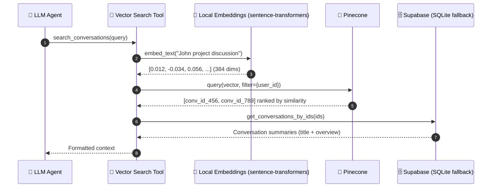

# reSpeaker Clip AI Agent

A voice-first AI assistant built on **Flask + LangGraph + Groq**. You speak (or type), the agent routes the request, decides which tools to use, answers, and speaks the reply back to you.

The architecture follows an Omi-style chat system: a LangGraph router classifies each request, the agentic branch gives the LLM access to tools, and a vector store lets the agent search your own past conversations.

## Features

- **Voice in / voice out** — Groq Whisper (STT) + Groq Orpheus (TTS)
- **Text chat with SSE streaming** — tokens stream live, then the answer is spoken (TTS)
- **LangGraph router** — three branches: `simple`, `agentic` (tools), `persona`
- **Tools**: web search (Tavily), calculator, Shopify Global Catalog, Notion to-do list, conversation vector search (Pinecone)
- **Long-term memory** — Mem0 (proactive recall + post-turn extraction)
- **Conversation history** — last 10 turns per conversation
- **Storage**: Supabase PostgreSQL (with a SQLite fallback for development/tests)

## Architecture

```
                    Browser (mic + chat UI)
                            │
                            ▼
                          Flask
                            │
              ┌─────────────┼─────────────┐
              │             │             │
              ▼             ▼             ▼
          SIMPLE        AGENTIC        PERSONA
                           │
              ┌────────────┼────────────┐
              │            │            │
              ▼            ▼            ▼
           Tavily      Calculator    Notion
              │            │            │
              │      search_conversations
              │            │            │
              │        Pinecone ◄── embeddings
              │            │
              └────┬───────┘
                   ▼
                 Groq LLM
                   │
        ┌──────────┴──────────┐
        ▼                     ▼
      Mem0 (memory)       Supabase (conversations)
        │                     │
        └──────────┬──────────┘
                   ▼
                response
                   │
         ┌──────────┴──────────┐
         ▼                     ▼
    TTS (audio)           SSE (text)
```

### Conversation vector search flow

When you ask a question about a past conversation, the agent calls the `search_conversations` tool, which embeds the query, finds matching conversations in Pinecone, and pulls their summaries from Supabase:



## Tech stack


| Area              | Technology                                  |
| ----------------- | ------------------------------------------- |
| Backend           | Flask, LangGraph, LangChain agents          |
| LLM / STT / TTS   | Groq (LLM, Whisper, Orpheus TTS)            |
| Router            | LangGraph (simple / agentic / persona)      |
| Web search        | Tavily                                      |
| To-do list        | Notion                                      |
| Long-term memory  | Mem0                                        |
| Relational store  | Supabase PostgreSQL (SQLite fallback)       |
| Vector store      | Pinecone (cosine)                           |
| Embeddings        | `sentence-transformers` `all-MiniLM-L6-v2` (local, 384-dim) |

## Prerequisites

- Python 3.10+
- A **Groq API key** (required — powers LLM, STT, TTS)
- Optional API keys (each feature degrades gracefully if missing):
  - **Tavily** — web search tool
  - **Mem0** — long-term memory
  - **Notion** — to-do list tool
  - **Supabase** — conversation storage (falls back to SQLite)
  - **Pinecone** — conversation vector search
  - **Shopify** — Global Catalog MCP product discovery and lookup

## Quick start

```bash
# 1. Clone and enter the project
git clone https://github.com/KasunThushara/reSpeaker-Clip-AI-Agent.git
cd reSpeaker-Clip-AI-Agent

# 2. Create and activate a virtual environment
python -m venv .venv
.venv\Scripts\activate        # Windows
source .venv/bin/activate     # macOS / Linux

# 3. Install dependencies
pip install -r requirements.txt

# 4. Create your environment file
cp .env.example .env          # then fill in your keys (see Configuration)

# 5. Run the server
python app.py
```

Open http://localhost:5000 — use the mic button (hold to speak) or the text box (the answer streams, then plays as audio).

## Configuration

Copy `.env.example` to `.env` and fill in the values. Only `GROQ_API_KEY` is strictly required.

| Variable                | Default                    | Purpose                              |
| ----------------------- | -------------------------- | ------------------------------------ |
| `GROQ_API_KEY`          | —                          | Groq LLM / STT / TTS                 |
| `GROQ_LLM_MODEL`        | `qwen/qwen3.6-27b`         | Main LLM (router, simple, persona)   |
| `GROQ_AGENT_MODEL`      | `openai/gpt-oss-20b`       | Agent (tool-calling) LLM             |
| `GROQ_STT_MODEL`        | `whisper-large-v3`         | Speech-to-text                       |
| `GROQ_TTS_MODEL`        | `canopylabs/orpheus-v1-english` | Text-to-speech                  |
| `TTS_VOICE`             | `autumn`                   | TTS voice                            |
| `STT_PROMPT`            | *(domain terms)*           | Whisper vocabulary hint              |
| `STT_LANGUAGE`          | `en`                       | STT language                         |
| `DATABASE_URL`          | `sqlite:///chat.db`        | SQLite fallback DB path              |
| `TAVILY_API_KEY`        | —                          | Web search tool                      |
| `SHOPIFY_ACCESS_TOKEN`  | —                          | Optional Shopify buyer-linked token |
| `SHOPIFY_AGENT_PROFILE` | Shopify example profile   | UCP agent profile URL                |
| `MEM0_API_KEY`          | —                          | Long-term memory                     |
| `MEM0_USER_ID`          | `user-1`                   | Mem0 memory scope                    |
| `NOTION_API_KEY`        | —                          | Notion to-do tool                    |
| `NOTION_DATABASE_ID`    | —                          | Notion "To-Do List" database         |
| `USER_ID`               | `user-1`                   | Single-user id across the system     |
| `SUPABASE_URL`          | —                          | Supabase project URL                 |
| `SUPABASE_KEY`          | —                          | Supabase service-role key            |
| `PINECONE_API_KEY`      | —                          | Pinecone vector store                |
| `PINECONE_INDEX_NAME`   | `conversations`            | Pinecone index name                  |
| `PINECONE_REGION`       | `us-east-1`                | Pinecone serverless region           |
| `EMBEDDING_MODEL`       | `all-MiniLM-L6-v2`         | Local embedding model                |

### Optional one-time setup

**Supabase (conversation storage):**
1. Create a Supabase project, copy `SUPABASE_URL` + the service-role key into `.env`.
2. Open the **SQL Editor** and run the schema in `supabase_schema.sql` (creates `users`, `conversations`, `messages` and seeds `user-1`).

If Supabase is not configured, the app falls back to SQLite (`chat.db`).

**Notion (to-do list tool):**
1. Create a Notion integration and paste the key into `.env`.
2. Create the database automatically:
   ```bash
   python -c "from backend.tools.notion import setup_notion_database; print(setup_notion_database())"
   ```
3. Paste the returned database id into `.env` as `NOTION_DATABASE_ID`.

**Pinecone (conversation search):**
Paste your key into `.env`. On startup the app auto-creates the `conversations` index (384-dim, cosine) and indexes each conversation asynchronously after every turn.

## API endpoints

| Method | Endpoint          | Description                                        |
| ------ | ----------------- | -------------------------------------------------- |
| GET    | `/api/health`     | Health check                                       |
| POST   | `/api/chat`       | Text chat → JSON `{response, conversation_id}`     |
| POST   | `/api/chat/stream`| Text chat → SSE (`thinking`, `token`, `done`)      |
| POST   | `/api/voice`      | Audio → STT → chat → TTS → `audio/wav`             |
| POST   | `/api/tts`        | `{text}` → `audio/wav`                             |

SSE event format:

```
event: thinking   data: {"tool": "web_search"}
event: token      data: {"text": "The"}
event: done       data: {"response": "...", "conversation_id": "..."}
```

## Testing

```bash
pytest
```

Tests use the SQLite fallback, so no external services are needed to run them.

## Project structure

```
app.py                       # Flask factory + dev server
config.py                    # Settings from .env
supabase_schema.sql          # Supabase table schema (run in SQL Editor)
frontend/
  templates/index.html       # UI (mic + text chat)
  static/js/app.js           # MediaRecorder + SSE consumer
backend/
  llm/
    client.py                # Groq LLM clients (llm, agent_llm)
    embeddings.py            # Local sentence-transformers embedding
    stt.py                   # Groq Whisper + domain corrections
    tts.py                   # Groq Orpheus (clean + truncate)
  graph/
    state.py                 # AgentState TypedDict
    router.py                # simple / context / persona + keyword pre-check
    graph.py                 # LangGraph StateGraph
    nodes/
      simple.py              # No-tool LLM response
      agentic.py             # create_agent with tools
      persona.py             # Styled LLM response
  tools/
    registry.py              # get_available_tools()
    search.py                # Tavily web search
    calculator.py            # Safe expression evaluator
    notion.py                # To-do list (add/list/complete/delete)
    conversation_search.py   # Search past conversations (Pinecone)
  database/
    chat.py                  # DB facade (Supabase + SQLite fallback)
    supabase_client.py       # Supabase client
  memory/
    client.py                # Mem0 recall / save / format
  services/
    conversation_service.py  # Async summarize + embed + index
  vector/
    pinecone.py              # Pinecone upsert / search
  routes/
    chat.py                  # /api/chat + /api/chat/stream (SSE)
    voice.py                 # /api/voice
    tts.py                   # /api/tts
    health.py                # /api/health
```

## Adding a new tool

1. Create a module in `backend/tools/`, e.g. `my_tool.py`, defining a `@tool` function:
   ```python
   from langchain_core.tools import tool

   @tool
   def my_tool(query: str) -> str:
       """Describe when the agent should call this tool."""
       return "result"
   ```
2. Add it to `backend/tools/registry.py` `get_available_tools()`.
3. (Optional) Mention it in the agent system prompt in `backend/graph/nodes/agentic.py`.

The agent (Groq `gpt-oss-20b` or whichever `GROQ_AGENT_MODEL`) then decides autonomously when to use it.

## How the voice pipeline works

```
mic → WebM audio → POST /api/voice
  → Groq Whisper (STT) → transcript
  → recall relevant Mem0 memories → LangGraph (router → node)
  → Groq LLM → response
  → save turn + memory + async vector index
  → Groq Orpheus (TTS) → audio/wav → browser speaker
```
