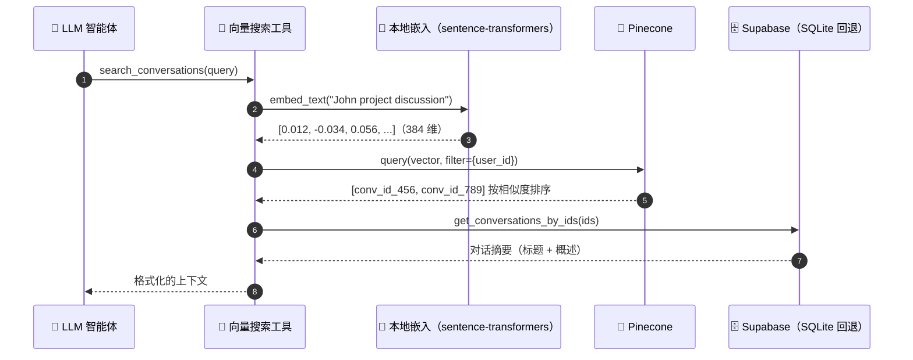

# reSpeaker Clip AI Agent

一个基于 **Flask + LangGraph + Groq** 的语音优先 AI 助手。你说话（或打字），智能体会路由请求、决定使用哪些工具、回答问题，并将回复语音播放给你。

架构遵循 Omi 风格的聊天系统：LangGraph 路由器对每个请求进行分类，智能体分支让 LLM 可以使用工具，向量存储让智能体可以搜索你过去的对话。

## 功能特性

- **语音输入 / 语音输出** — Groq Whisper（STT）+ Groq Orpheus（TTS）
- **带 SSE 流式传输的文本聊天** — token 实时流式传输，然后回答会被语音播放（TTS）
- **LangGraph 路由器** — 三个分支：`simple`、`agentic`（工具）、`persona`
- **工具**：网页搜索（Tavily）、计算器、Shopify Global Catalog、Notion 待办列表、对话向量搜索（Pinecone）
- **长期记忆** — Mem0（主动召回 + 轮次后提取）
- **对话历史** — 每个对话保留最近 10 轮
- **存储**：Supabase PostgreSQL（开发和测试时可回退到 SQLite）

## 架构

```
                    浏览器（麦克风 + 聊天界面）
                            │
                            ▼
                          Flask
                            │
              ┌─────────────┼─────────────┐
              │             │             │
              ▼             ▼             ▼
          SIMPLE        AGENTIC        PERSONA
                           │
              ┌────────────┼────────────┐
              │            │            │
              ▼            ▼            ▼
           Tavily      Calculator    Notion
              │            │            │
              │      search_conversations
              │            │            │
              │        Pinecone ◄── embeddings
              │            │
              └────┬───────┘
                   ▼
                 Groq LLM
                   │
        ┌──────────┴──────────┐
        ▼                     ▼
      Mem0（记忆）       Supabase（对话）
        │                     │
        └──────────┬──────────┘
                   ▼
                 响应
                   │
         ┌──────────┴──────────┐
         ▼                     ▼
    TTS（音频）           SSE（文本）
```

### 对话向量搜索流程

当你询问关于过去对话的问题时，智能体会调用 `search_conversations` 工具，该工具会对查询进行向量化，在 Pinecone 中查找匹配的对话，并从 Supabase 中提取其摘要：



## 技术栈


| 领域              | 技术                                        |
| ----------------- | ------------------------------------------- |
| 后端               | Flask、LangGraph、LangChain agents          |
| LLM / STT / TTS   | Groq（LLM、Whisper、Orpheus TTS）          |
| 路由器             | LangGraph（simple / agentic / persona）     |
| 网页搜索           | Tavily                                      |
| 待办列表           | Notion                                      |
| 长期记忆           | Mem0                                        |
| 关系型存储         | Supabase PostgreSQL（SQLite 回退）         |
| 向量存储           | Pinecone（余弦相似度）                      |
| 嵌入               | `sentence-transformers` `all-MiniLM-L6-v2`（本地，384 维） |

## 前置条件

- Python 3.10+
- **Groq API 密钥**（必需 — 驱动 LLM、STT、TTS）
- 可选 API 密钥（每个功能在缺失时会优雅降级）：
  - **Tavily** — 网页搜索工具
  - **Mem0** — 长期记忆
  - **Notion** — 待办列表工具
  - **Shopify** — Global Catalog MCP 商品发现和查询
  - **Supabase** — 对话存储（回退到 SQLite）
  - **Pinecone** — 对话向量搜索

## 快速开始

```bash
# 1. 克隆并进入项目
git clone https://github.com/KasunThushara/reSpeaker-Clip-AI-Agent.git
cd reSpeaker-Clip-AI-Agent

# 2. 创建并激活虚拟环境
python -m venv .venv
.venv\Scripts\activate        # Windows
source .venv/bin/activate     # macOS / Linux

# 3. 安装依赖
pip install -r requirements.txt

# 4. 创建环境变量文件
cp .env.example .env          # 然后填入你的密钥（见配置说明）

# 5. 运行服务器
python app.py
```

打开 http://localhost:5000 — 使用麦克风按钮（按住说话）或文本框（回答会流式传输，然后以音频播放）。

## 配置

将 `.env.example` 复制为 `.env` 并填入值。只有 `GROQ_API_KEY` 是严格必需的。

| 变量                    | 默认值                     | 用途                                 |
| ----------------------- | -------------------------- | ------------------------------------ |
| `GROQ_API_KEY`          | —                          | Groq LLM / STT / TTS                 |
| `GROQ_LLM_MODEL`        | `qwen/qwen3.6-27b`         | 主 LLM（路由器、simple、persona）    |
| `GROQ_AGENT_MODEL`      | `openai/gpt-oss-20b`       | 智能体（工具调用）LLM               |
| `GROQ_STT_MODEL`         | `whisper-large-v3`         | 语音转文字                           |
| `GROQ_TTS_MODEL`         | `canopylabs/orpheus-v1-english` | 文字转语音                     |
| `TTS_VOICE`              | `autumn`                   | TTS 语音                             |
| `STT_PROMPT`             | *（领域术语）*             | Whisper 词汇提示                     |
| `STT_LANGUAGE`           | `en`                       | STT 语言                             |
| `DATABASE_URL`           | `sqlite:///chat.db`        | SQLite 回退数据库路径                |
| `TAVILY_API_KEY`         | —                          | 网页搜索工具                         |
| `SHOPIFY_ACCESS_TOKEN`   | —                          | 可选的 Shopify buyer-linked token    |
| `SHOPIFY_AGENT_PROFILE`  | Shopify 示例 profile       | UCP Agent profile URL                |
| `MEM0_API_KEY`           | —                          | 长期记忆                             |
| `MEM0_USER_ID`           | `user-1`                   | Mem0 记忆范围                         |
| `NOTION_API_KEY`         | —                          | Notion 待办工具                       |
| `NOTION_DATABASE_ID`     | —                          | Notion "To-Do List" 数据库           |
| `USER_ID`                | `user-1`                   | 全系统单用户 ID                       |
| `SUPABASE_URL`           | —                          | Supabase 项目 URL                     |
| `SUPABASE_KEY`           | —                          | Supabase 服务角色密钥                 |
| `PINECONE_API_KEY`       | —                          | Pinecone 向量存储                     |
| `PINECONE_INDEX_NAME`    | `conversations`            | Pinecone 索引名称                     |
| `PINECONE_REGION`        | `us-east-1`                | Pinecone 无服务器区域                |
| `EMBEDDING_MODEL`        | `all-MiniLM-L6-v2`         | 本地嵌入模型                         |

### 可选的一次性设置

**Supabase（对话存储）：**
1. 创建一个 Supabase 项目，将 `SUPABASE_URL` + 服务角色密钥复制到 `.env`。
2. 打开 **SQL 编辑器** 并运行 `supabase_schema.sql` 中的模式（创建 `users`、`conversations`、`messages` 表并初始化 `user-1`）。

如果未配置 Supabase，应用会回退到 SQLite（`chat.db`）。

**Notion（待办列表工具）：**
1. 创建一个 Notion 集成并将密钥粘贴到 `.env`。
2. 自动创建数据库：
   ```bash
   python -c "from backend.tools.notion import setup_notion_database; print(setup_notion_database())"
   ```
3. 将返回的数据库 ID 粘贴到 `.env` 作为 `NOTION_DATABASE_ID`。

**Pinecone（对话搜索）：**
将你的密钥粘贴到 `.env`。启动时应用会自动创建 `conversations` 索引（384 维，余弦相似度），并在每轮对话后异步索引每个对话。

## API 端点

| 方法   | 端点              | 描述                                               |
| ------ | ----------------- | -------------------------------------------------- |
| GET    | `/api/health`     | 健康检查                                           |
| POST   | `/api/chat`       | 文本聊天 → JSON `{response, conversation_id}`      |
| POST   | `/api/chat/stream`| 文本聊天 → SSE（`thinking`、`token`、`done`）       |
| POST   | `/api/voice`      | 音频 → STT → 聊天 → TTS → `audio/wav`             |
| POST   | `/api/tts`        | `{text}` → `audio/wav`                             |

SSE 事件格式：

```
event: thinking   data: {"tool": "web_search"}
event: token      data: {"text": "The"}
event: done       data: {"response": "...", "conversation_id": "..."}
```

## 测试

```bash
pytest
```

测试使用 SQLite 回退，因此运行时不需要外部服务。

## 项目结构

```
app.py                       # Flask 工厂 + 开发服务器
config.py                    # 来自 .env 的设置
supabase_schema.sql          # Supabase 表结构（在 SQL 编辑器中运行）
frontend/
  templates/index.html       # 界面（麦克风 + 文本聊天）
  static/js/app.js           # MediaRecorder + SSE 消费者
backend/
  llm/
    client.py                # Groq LLM 客户端（llm、agent_llm）
    embeddings.py            # 本地 sentence-transformers 嵌入
    stt.py                   # Groq Whisper + 领域术语修正
    tts.py                   # Groq Orpheus（清理 + 截断）
  graph/
    state.py                 # AgentState TypedDict
    router.py                # simple / context / persona + 关键词预检查
    graph.py                 # LangGraph StateGraph
    nodes/
      simple.py              # 无工具 LLM 响应
      agentic.py             # 带工具的 create_agent
      persona.py             # 风格化 LLM 响应
  tools/
    registry.py              # get_available_tools()
    search.py                # Tavily 网页搜索
    calculator.py            # 安全表达式求值器
    notion.py                # 待办列表（添加/列表/完成/删除）
    conversation_search.py   # 搜索过去对话（Pinecone）
  database/
    chat.py                  # 数据库门面（Supabase + SQLite 回退）
    supabase_client.py       # Supabase 客户端
  memory/
    client.py                # Mem0 召回 / 保存 / 格式化
  services/
    conversation_service.py  # 异步摘要 + 嵌入 + 索引
  vector/
    pinecone.py              # Pinecone upsert / search
  routes/
    chat.py                  # /api/chat + /api/chat/stream（SSE）
    voice.py                 # /api/voice
    tts.py                   # /api/tts
    health.py                # /api/health
```

## 添加新工具

1. 在 `backend/tools/` 中创建一个模块，例如 `my_tool.py`，定义一个 `@tool` 函数：
   ```python
   from langchain_core.tools import tool

   @tool
   def my_tool(query: str) -> str:
       """描述智能体何时应该调用此工具。"""
       return "result"
   ```
2. 将其添加到 `backend/tools/registry.py` 的 `get_available_tools()` 中。
3.（可选）在 `backend/graph/nodes/agentic.py` 的智能体系统提示中提及它。

智能体（Groq `gpt-oss-20b` 或任何 `GROQ_AGENT_MODEL`）随后会自主决定何时使用它。

## 语音管道工作原理

```
麦克风 → WebM 音频 → POST /api/voice
  → Groq Whisper（STT）→ 转录文本
  → 召回相关 Mem0 记忆 → LangGraph（路由器 → 节点）
  → Groq LLM → 响应
  → 保存轮次 + 记忆 + 异步向量索引
  → Groq Orpheus（TTS）→ audio/wav → 浏览器扬声器
```
